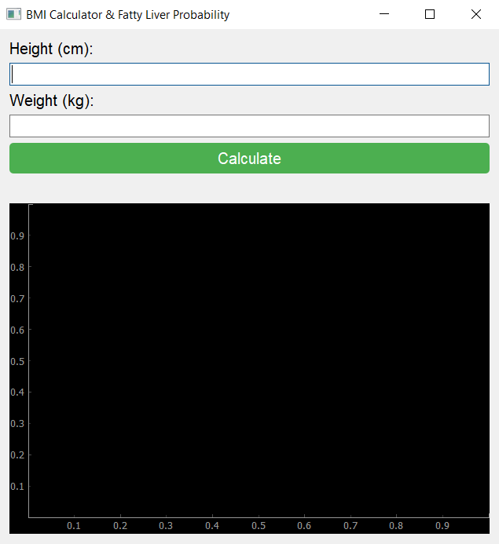
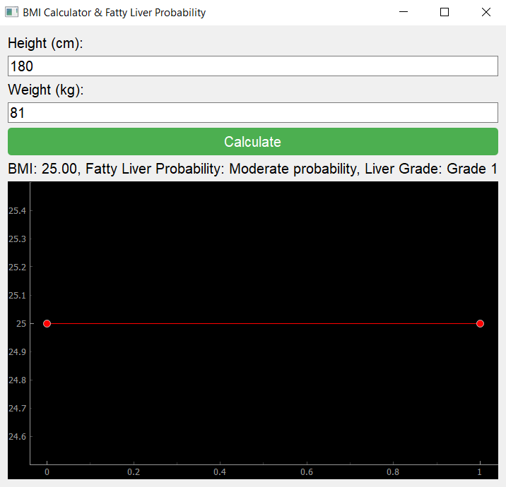

  
  
  <h1>This is CS50.</h1>

  <h2>CS50’s Introduction to Programming with Python Final Project</h2>
  
  <h3>A’adel Sayyahi</h3>

# BMI Calculator & Fatty Liver Probability 🧮

## 📖 Description
Fatty liver disease occurs when excess fat accumulates in the liver cells. Factors such as high-fat food consumption, alcohol intake, diabetes, and obesity contribute to this condition. A high **BMI (Body Mass Index)**—especially over 25—can increase the risk of fatty liver.

**BMI** is a widely used measurement that evaluates whether a person has a healthy weight for their height. It is calculated using the formula:

\[ BMI = \frac{weight (kg)}{(height (m))^2} \]

The classification is as follows:
- **Underweight:** BMI < 18.5
- **Normal weight:** BMI 18.5 - 24.9
- **Overweight:** BMI 25 - 29.9
- **Obese:** BMI ≥ 30

Although BMI is a useful indicator, diagnosing fatty liver requires **medical tests** such as blood analysis and ultrasound imaging. This program provides only an **estimated probability** of fatty liver based on BMI.

---

## 💻 About the Project
### 📌 Introduction
This Python-based **BMI Calculator & Fatty Liver Probability Estimator** provides users with:
- A **graphical user interface (GUI)** built with **PyQt5**
- **Data visualization** using **pyqtgraph**
- BMI calculation based on user input (height & weight)
- A basic estimation of **fatty liver probability and severity**

### 🛠 Code Breakdown
1. **Libraries**: Imports `sys`, `PyQt5`, and `pyqtgraph`.
2. **BMICalculator Class**:
   - Defines GUI elements (labels, input fields, buttons, graph)
   - Organizes layout using `QVBoxLayout`
3. **calculate() Method**:
   - Computes **BMI** from user input
   - Determines **fatty liver probability and grade**
   - Updates the result label and plots the BMI value
4. **plot_data() Method**:
   - Uses `pyqtgraph` to display BMI graphically
5. **Helper Functions**:
   - `determine_fatty_liver_prob(bmi)`: Estimates probability
   - `determine_fatty_liver_degree(bmi)`: Assigns severity grade
6. **Main Function**:
   - Runs the **PyQt5 application loop**

---

## 📸 Sample Test with Images
Below is an example of the program in action, displaying BMI calculations with two sample images:

---

## ✅ Conclusion
This project provides a simple **BMI calculator** with **fatty liver probability estimation**. While BMI is a useful health indicator, a **medical diagnosis** is necessary for confirming fatty liver disease.

💡 **Future Improvements:** Integrating **medical imaging analysis** (ultrasound, CT) using **AI** for **accurate detection**.

🔹 **Developed as part of CS50P 2022** 🔹

📜 Certification
This project is a result of my participation in the CS50P 2022 course, which I have successfully completed. My certificate can be verified at the following link:

🔗 [Certificate Verification Link](https://certificates.cs50.io/d3edec4b-c449-417b-84ac-0c1f8cf69dc0.pdf?size=letter)  

